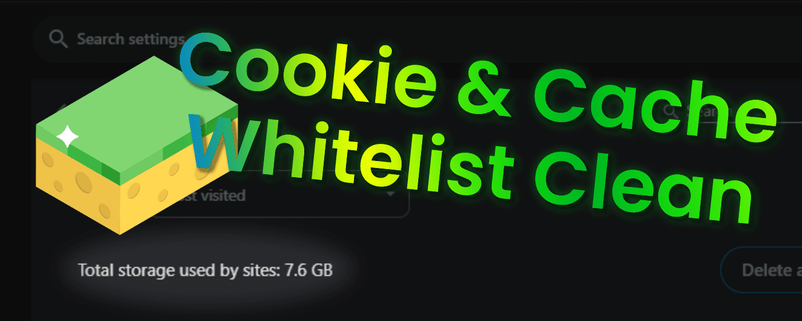
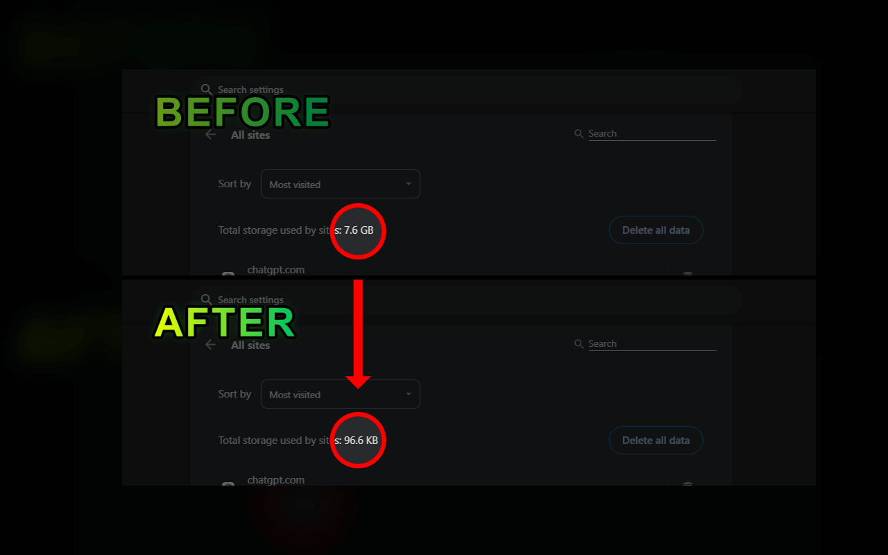
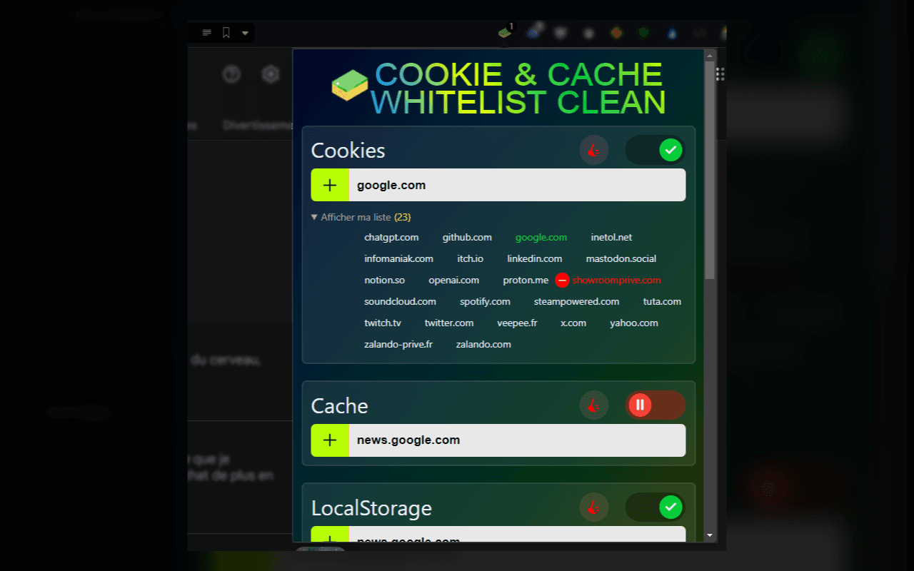
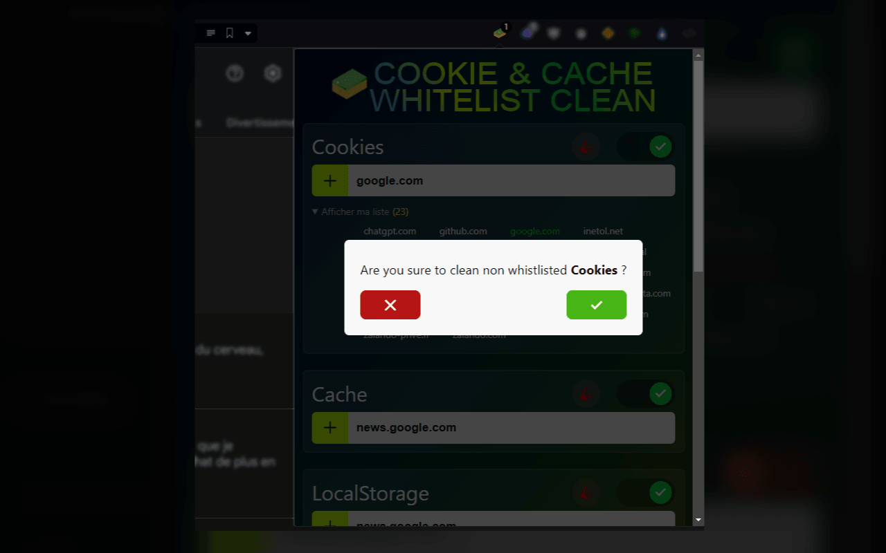
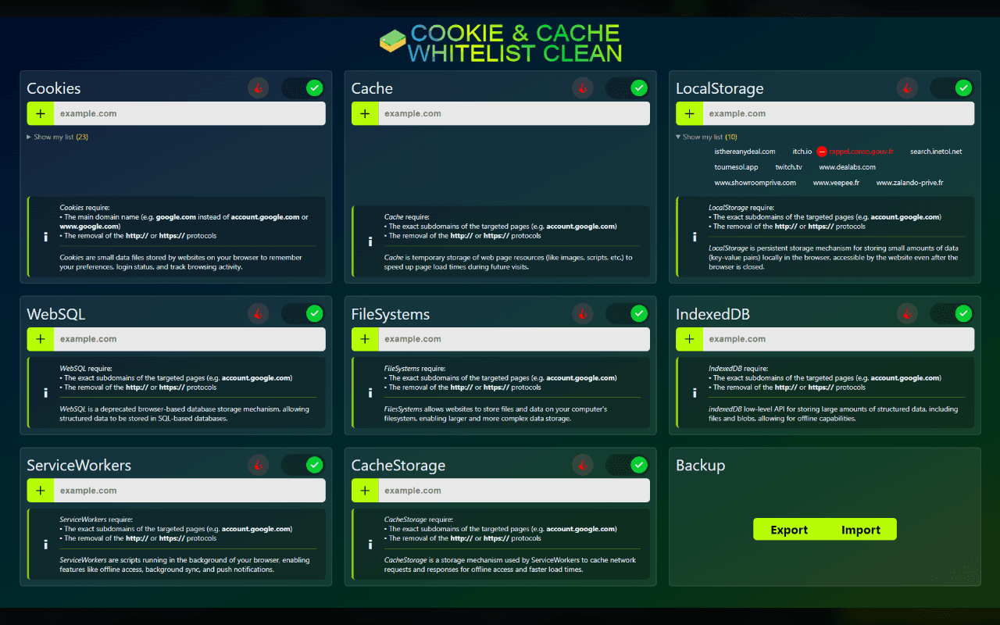

# Cookies & Cache Whitelist Clean

Tired of seeing gigabytes used by several different types of caches?\
Set your own whitelists, and everything else will be removed when your browser starts up!

> [!NOTE]
> Credits: 
> Domain Check Library: https://github.com/lupomontero/psl 
> Icon: https://www.flaticon.com/authors/vectorsmarket15